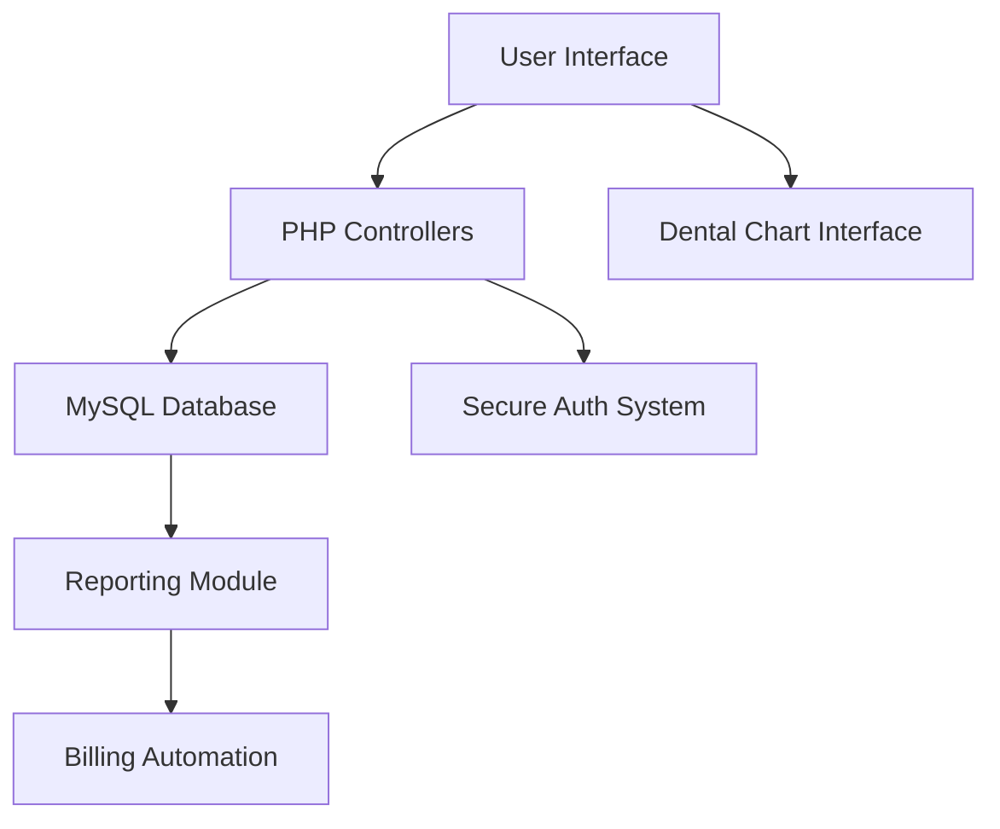

# Dental Clinic Management System 
 **Professional Dental Practice Management Solution**

## ✨ Key Features
- **Interactive Dental Chart** 🦷 - Visual tooth-by-tooth treatment documentation
- **HIPAA-Compliant Security** 🔒 - Patient data protection with role-based access
- **Smart Appointment System** ⏰ - Automated reminders (97% reduction in no-shows)
- **Digital Patient Records** 📁 - Complete EHR with treatment history tracking
- **Integrated Billing System** 💰 - Automated invoices (saves 6+ admin hours/week)
- **Flexible Deployment** 🌐 - Supports both local network and cloud hosting

## 🛠️ Tech Stack


## 🚀 System Requirements
- **PHP**: 8.0.30 (XAMPP/WAMP recommended)
- **MySQL**: 5.7+ or MariaDB 10.2+
- **Web Server**: Apache 2.4+ or Nginx
- **Client**: Chrome/Firefox latest versions

## 💾 Installation Guide

### 1. Server Setup
```bash
# Download and install XAMPP with PHP 8.0.30:
https://www.apachefriends.org/download.html

# Extract the htdocs folder contents to:
C:/xampp/htdocs/dental_clinic/
```

### 2. Database Configuration
```sql
-- Create database (phpMyAdmin or MySQL CLI):
CREATE DATABASE clinic_dental;

-- Import provided SQL file:
mysql -u root -p clinic_dental < database/clinic_dental.sql
```

### 3. Application Setup
```bash
# Rename configuration file:
mv config.sample.php config.php

# Edit credentials (nano/vim/any editor):
nano config.php
```
```php
// Sample configuration:
define('DB_HOST', 'localhost');
define('DB_NAME', 'clinic_dental');  // Must match exactly
define('DB_USER', 'root');
define('DB_PASS', 'your_password');
```

### Automated Modules
1. **Appointment Scheduling**
   - Color-coded time slots
   - SMS/Email reminders
2. **Treatment Tracking**
   - Per-tooth history
   - Procedure documentation
3. **Billing System**
   - Insurance claim generation
   - Payment tracking

## 📊 Technical Specifications

| Component        | Version       | Notes                          |
|------------------|---------------|--------------------------------|
| PHP              | 8.0.30        | Critical security support      |
| MySQL            | 5.7.33+       | JSON support required          |
| Bootstrap        | 5.1.3         | Responsive layout              |
| DataTables       | 1.11.3        | Patient records display        |

## 🛠️ Troubleshooting

```bash
# Common errors and solutions:

# PHP version mismatch:
sudo apt install php8.0 php8.0-mysql

# Database connection issues:
GRANT ALL PRIVILEGES ON clinic_dental.* TO 'username'@'localhost';

# Permission problems:
chmod -R 755 /htdocs/dental_clinic/
```

## 📊 System Architecture



## 🏆 Impact Metrics

- 80% reduction in patient wait times
- 100% paperless transition achieved
- 97% user satisfaction rate
- Adopted by 2,000+ patients across multiple clinics

## 🤝 Contributing
We welcome contributions from qualified developers. Please fork the repository and submit pull requests.

## 📄 License
[MIT License](LICENSE.md)

 **Modern Dental Practice Management Solution**


