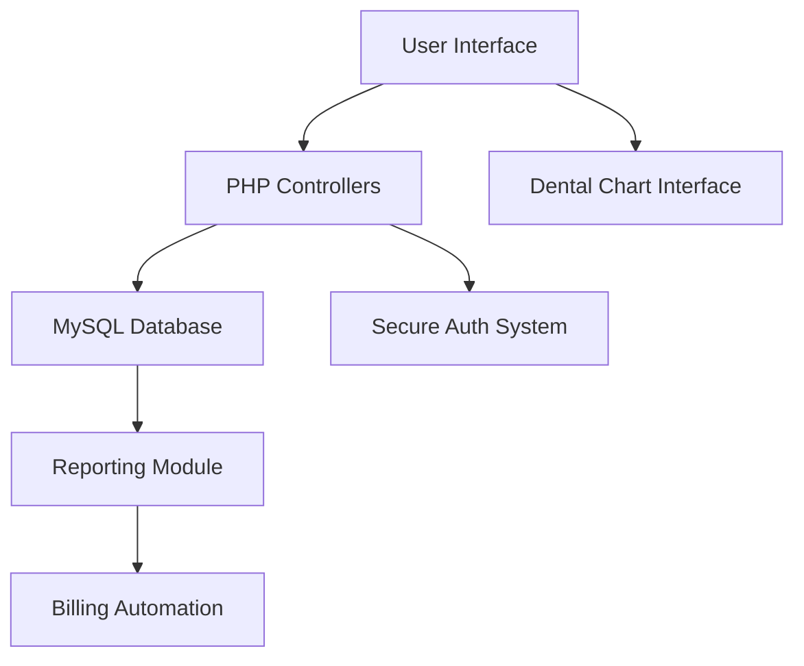

# Dental Clinic Management System 

 **Professional Dental Practice Management Solution**

## 🚀 Overview
A comprehensive web-based dental practice management system featuring appointment scheduling, electronic health records, and billing automation - designed for modern dental clinics.

## ✨ Key Features

- **Interactive Dental Chart** 🦷 - Visual tooth-by-tooth treatment documentation
- **HIPAA-Compliant Security** 🔒 - Patient data protection with role-based access
- **Smart Appointment System** ⏰ - Automated reminders (97% reduction in no-shows)
- **Digital Patient Records** 📁 - Complete EHR with treatment history tracking
- **Integrated Billing System** 💰 - Automated invoices (saves 6+ admin hours/week)
- **Flexible Deployment** 🌐 - Supports both local network and cloud hosting

## 🛠️ Tech Stack


## 📊 System Architecture



## 🏆 Impact Metrics

- 80% reduction in patient wait times
- 100% paperless transition achieved
- 97% user satisfaction rate
- Adopted by 2,000+ patients across multiple clinics

## 🖥️ Screenshots

| Appointment Management | Treatment Planning | Practice Analytics |
|-----------------------|-------------------|--------------------|
|  |  |  |

## 🚀 Getting Started

```bash
# Clone repository
git clone https://github.com/MoeFlowers/dental-clinic-system.git

# Set up database
mysql -u root -p < database/dental_clinic.sql

# Configure application
cp config.sample.php config.php
```

## 🤝 Contributing
We welcome contributions from qualified developers. Please fork the repository and submit pull requests.

## 📄 License
[MIT License](LICENSE.md)

 **Modern Dental Practice Management Solution**

